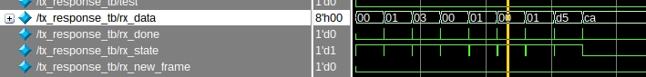
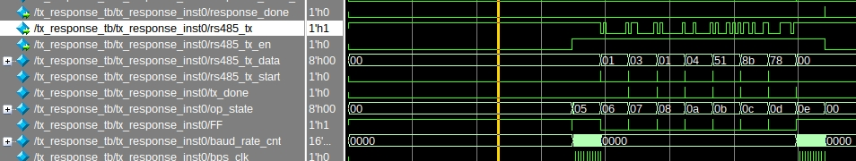
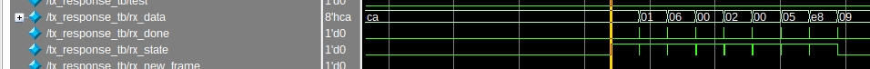
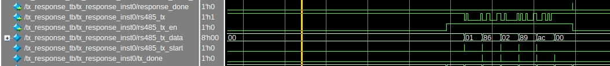
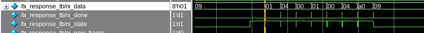
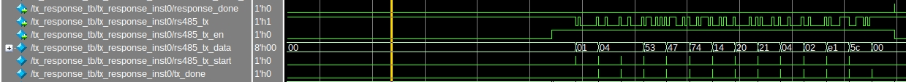
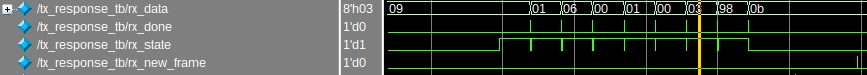
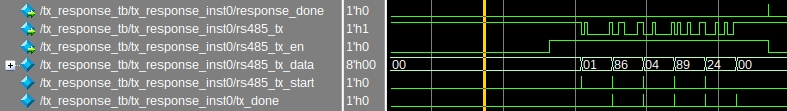
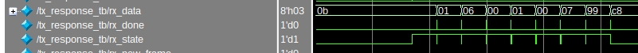
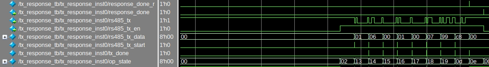

# Modbus RTU Slave Pure RTL design for FPGA
design a ip implements Modbus RTU slave sub function 03 04 06 on FPGA.

Function code: 03 04 06

Exception code: 01 02 03 04

Function 03: ligal reg 0001, ligal quantiy 0001

Function 04: ligal reg 0001~0004, ligal quantiy + ligal reg < 0005

Function 06: ligal reg 0001, ligal data 0000~0017, coresponding to Function 03 reg 0001

## uart tx and uart rx
done

uart_byte_tx_tb.do

uart_byte_rx_tb.do

## rx 3.5T and 1.5T interval detect
done

ct_35t_gen_tb.do

ct_15t_gen_tb.do

## rx slave address and frame check
done

frame_rx_tb.do

## checksum if slave address check pass
done

modbus_crc_tb.do

## Exception handling (exclude 04)
### checksum mismatch then do nothing
### illegal fuction code retrun 01
### illegal address return 02
### illegal quantity return 03

done

exceptions_tb.do

# read / write func logic
done

func_handler_tb.do

# response frame
## read response frame
### rs485 tx en signal (before tx 1T enable, after tx 1T disable)
### tx crc
## fuction code 06
### write fail return Exception 04
### write ok response frame
done

tx_response_tb.do

# wave
tx_response_tb.do
## func_code 03

assign code 03 reg 0001 value 0451

response is ok

## illegal exception response

here 06 dosen't have reg 0002, so it's illegal

response is ok

## func_code 04

read 4 regs from 0001

response is ok

## write fail exception

after a write fail

response is ok

## write ok response

response is ok

# top wrapper
done

modbus_rtu_slave_top_tb.do